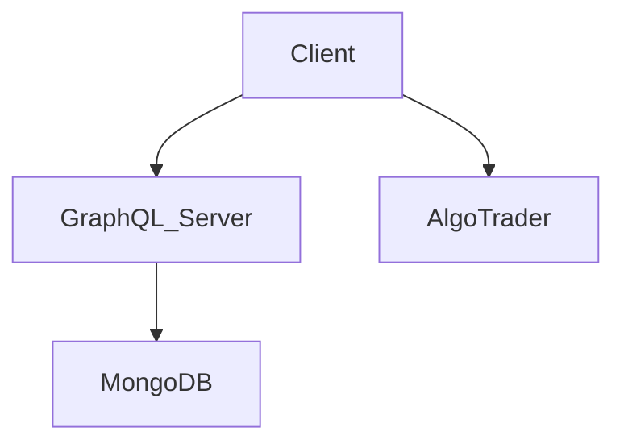

# CryptoTraderWebApp

This is a full stack React application that uses Apollo GraphQL to communicate with the MongoDB database. This allows a user to create a profile and choose the
trading algorithm of thier choice to make money and track thier profit and loss.

There needs to be a config.js file that contains the MongoDB parameters

        module.exports = {
            MONGODB: <url>,
            SECRET_KEY: <secret_key>
        };

